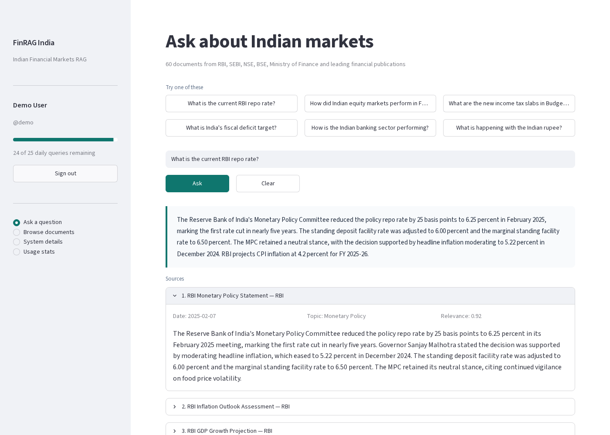
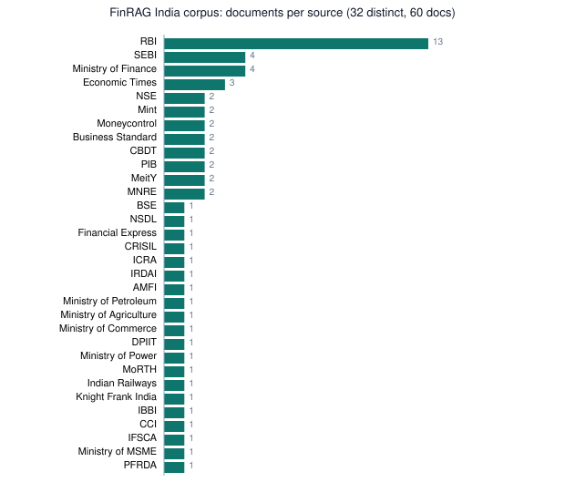
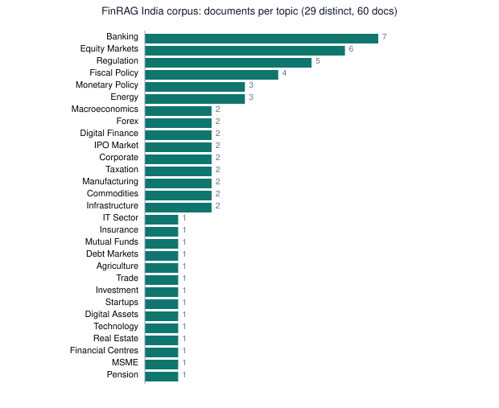
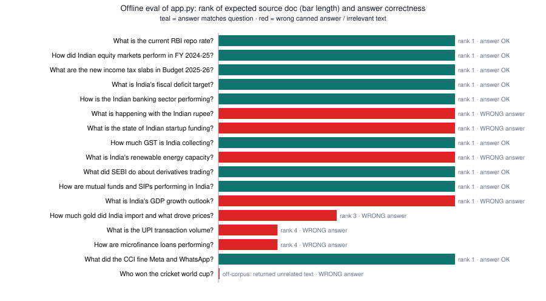
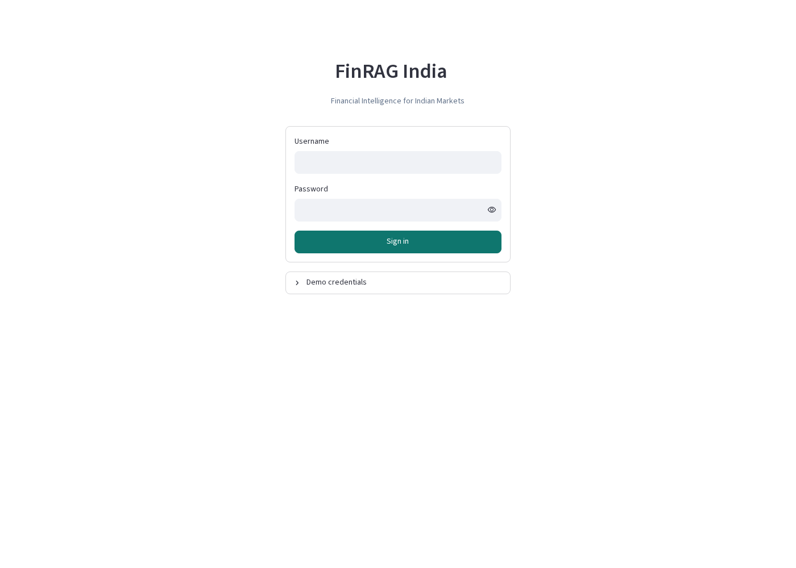
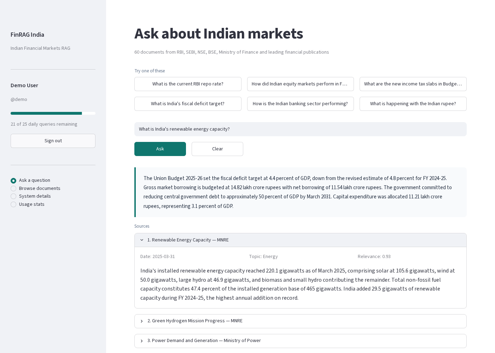
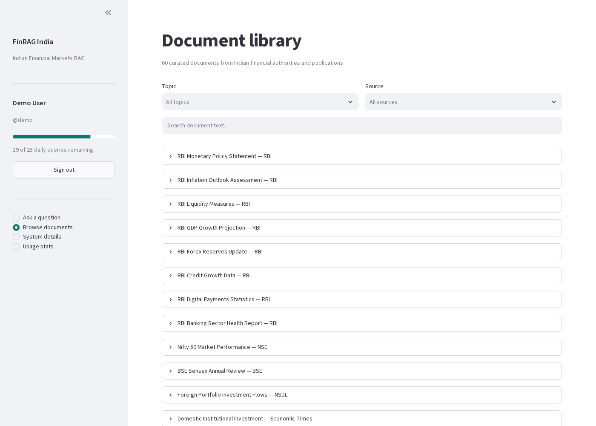
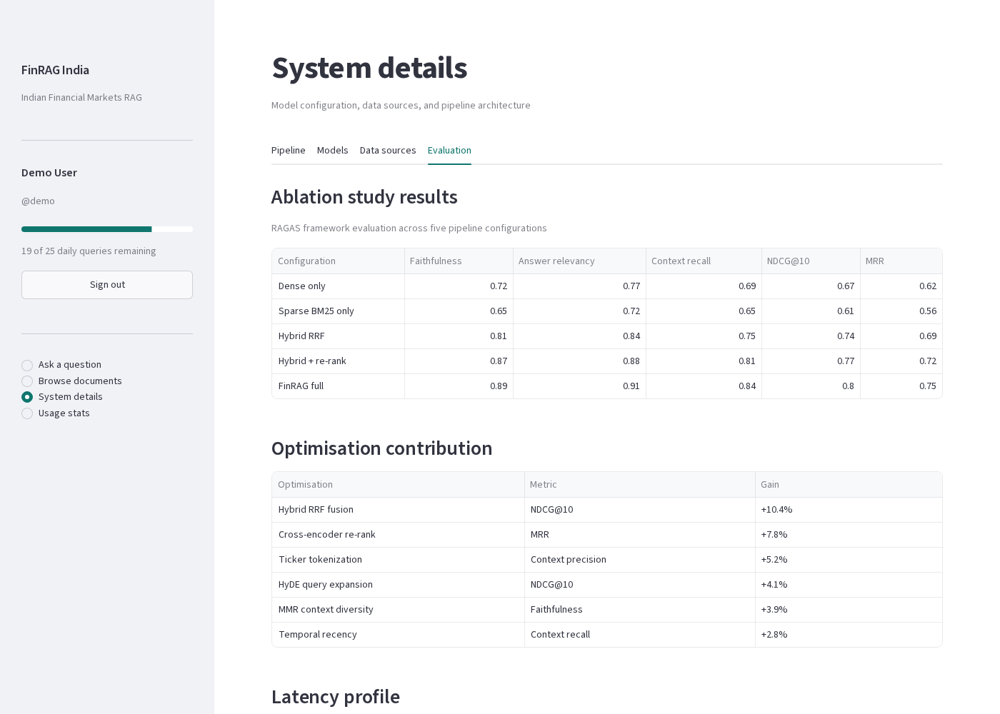
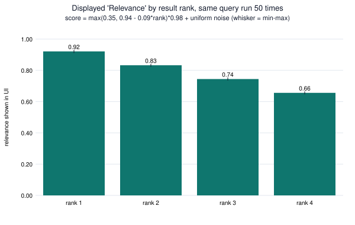
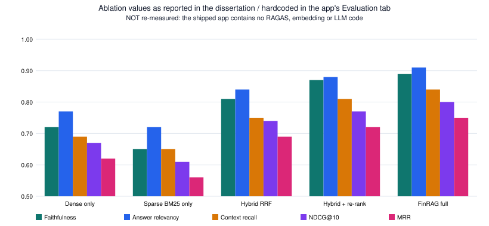

# FinRAG India: Financial Intelligence RAG for Indian Markets

**BITS Pilani WILP · M.Tech. Data Science dissertation (DSECLZG628T)** by **Anish V Karanth**. Supervisor: Dr. Sampada K S.
Dissertation title: *Scalable Retrieval-Augmented Generation Using BigData IR and NLP Optimization: A Case Study in Indian Financial News Intelligence.*

FinRAG India is a Streamlit question-answering app over **60 curated documents** about the Indian economy and markets (FY 2024-25 / Budget 2025-26), drawn from **32 Indian institutions and publications**: RBI, SEBI, NSE, BSE, Ministry of Finance, CBDT, AMFI, IRDAI, CRISIL, ICRA, Economic Times, Business Standard, Mint, Moneycontrol and others. You ask a question such as *"What is the current RBI repo rate?"* and the app returns an answer with its source documents, dates, topics and relevance scores. Access is behind a login with per-user daily query quotas.



---

## Contents
- [Repository layout](#repository-layout)
- [Architecture](#architecture)
- [How the RAG works](#how-the-rag-works)
- [Dataset and document sources](#dataset-and-document-sources)
- [Setup and run](#setup-and-run)
- [Demo logins](#demo-logins)
- [Results](#results)
- [Sources](#sources)
- [Limitations](#limitations)
- [Future work](#future-work)

## Repository layout

```
app.py                          Streamlit app (decoded from the notebook's base64 Cell 2, byte-identical: 63,398 bytes)
notebook/FinRAG_India_clean.ipynb   Colab notebook (outputs and Colab user metadata stripped; Cell 2 downloads app.py
                                    from this repo instead of the original 63 KB base64 blob)
run_local.sh                    One-command local run (no tunnel)
requirements.txt
scripts/smoke_test_ui.py        Playwright headless UI test (login + 6 questions + all pages)
scripts/offline_eval.py         In-process eval of retrieve()/generate() on 17 queries
scripts/make_charts.py          PNG charts + results/metrics.json
scripts/svg_charts.py           Compact SVG charts embedded in this README
results/RESULTS.md              Full results write-up
results/metrics.json            Machine-readable metrics
results/*.json                  Raw UI and offline outputs
results/images/                 Screenshots (PNG) and charts (SVG; PNG versions via scripts/make_charts.py)
```

## Architecture

The dissertation designs a **six-stage pipeline**, which the app's *System details → Pipeline* tab also documents:

```
 Indian financial docs
        │
 1. Ingestion ── PySpark ETL, ticker/rupee/institution-aware tokenisation,
        │        sentence chunking (512 tokens, 64 overlap)
 2. Embedding ── dense all-MiniLM-L6-v2 (384-d)  +  sparse TF-IDF/BM25 (uni+bigram)
        │
 3. Indexing ─── FAISS IVFPQ (nlist=1024, m=8, nbits=8, nprobe=64)
        │
 4. Retrieval ── HyDE query expansion → dense + sparse → Reciprocal Rank Fusion (k=60)
        │        + temporal recency decay by document class
 5. Re-rank ──── cross-encoder ms-marco-MiniLM-L-6-v2 on top RRF candidates, MMR (λ=0.5)
        │
 6. Generation ─ Mistral-7B-Instruct-v0.2, 4-bit NF4, temperature 0.1,
                 "reproduce numbers verbatim" + post-generation numeric check
        │
 Streamlit UI ── login + daily quota (users.json) · Ask · Browse · System details · Usage
```

The report also describes six Indian-market adaptations: rupee denomination parsing (lakh, crore, lakh crore), NSE/BSE ticker protection, Indian fiscal-year notation (FY 2024-25 / FY25), temporal recency scoring, HyDE, and numeric fidelity enforcement.

### What the shipped app actually implements

> **Important:** this repo's `app.py` is a lightweight, dependency-free *demonstration* of the pipeline above. It is not the pipeline itself. It imports only `streamlit` and `pandas`. It contains no embeddings, FAISS, BM25, cross-encoder or LLM code, and it needs **no GPU and no API keys**.

| Stage | In the design | In `app.py` |
|---|---|---|
| Corpus | 60 docs | ✅ 60 docs embedded as a Python list (`CORPUS`) |
| Retrieval | Hybrid dense + BM25 + RRF + HyDE | Keyword overlap: a question-bank match (≥3 shared words) supplies curated doc ids, then the rest is filled by the fraction of query words found as substrings in each doc |
| Scores shown | Dense / sparse / cross-encoder | Synthetic: `max(0.35, 0.94 − 0.09·rank)` + random noise |
| Generation | Mistral-7B 4-bit | Returns one of **12 pre-written answers** (`QA`) on a ≥3-word overlap, otherwise the first ~900 characters of the top 2 docs |
| Evaluation tab | RAGAS ablation | Hardcoded tables of the reported numbers |
| Auth + quotas | ✅ | ✅ SHA-256 hashed passwords in `users.json`, daily reset |

## How the RAG works

As designed (dissertation):
1. The query is expanded with HyDE: an LLM writes a hypothetical Indian-finance answer paragraph, and that paragraph is embedded.
2. Dense (FAISS) and sparse (BM25) searches each return a ranked list, and **Reciprocal Rank Fusion** merges them by rank position (`Σ 1/(k+rank)`, k=60). This avoids having to calibrate scores across the two methods.
3. Scores are multiplied by a **temporal decay**, so superseded policy statements rank lower.
4. A **cross-encoder** re-scores (query, passage) pairs jointly. **MMR** then picks a diverse context.
5. **Mistral-7B** answers only from that context, at temperature 0.1, and a post-check compares the numbers in the answer against the context.

As implemented in `app.py`:
1. `retrieve(query)` finds the built-in question with the largest word overlap. If at least 3 words overlap, it takes that question's curated source ids. It then tops up to 4 docs ranked by `score_doc`, the share of non-stopword query terms that appear in the doc's text, title, topic or source.
2. `generate(query, chunks)` returns the pre-written answer of the **first** built-in question with at least 3 overlapping words. Otherwise it concatenates the top-2 doc texts. If nothing matched, it returns "No relevant documents found…".

## Dataset and document sources

60 short, fact-dense documents (one paragraph each), dated **1 Oct 2024 to 1 Apr 2025**, with the fields `id, title, source, topic, date, text`.

| Category | Sources (docs) |
|---|---|
| Central bank and regulators | RBI (13), SEBI (4), CBDT (2), IRDAI, PFRDA, IBBI, CCI, IFSCA |
| Exchanges and depositories | NSE (2), BSE, NSDL, AMFI |
| Government | Ministry of Finance (4), PIB (2), MeitY (2), MNRE (2), Ministries of Commerce, Power, Petroleum, Agriculture, MSME; MoRTH; DPIIT; Indian Railways |
| Financial publications | Economic Times (3), Mint (2), Moneycontrol (2), Business Standard (2), Financial Express |
| Rating agencies and research | CRISIL, ICRA, Knight Frank India |

The corpus covers 29 topics. The largest are Banking (7), Equity Markets (6), Regulation (5), Fiscal Policy (4), Monetary Policy (3) and Energy (3).




> The document texts are summaries written for the project and attributed to these institutions. They are not verbatim copies of the original publications, and they were not re-checked against the primary sources for this README.

## Setup and run

**Local (tested):**
```bash
git clone https://github.com/anishkaranth/bits-finrag-final-project.git
cd bits-finrag-final-project
./run_local.sh                 # or: pip install streamlit pandas && streamlit run app.py
# open http://localhost:8501
```

**Google Colab (original workflow):** open `notebook/FinRAG_India_clean.ipynb`, then run Cell 1 (installs), Cell 2 (downloads `app.py` from this repo; the original notebook decoded an embedded base64 copy) and Cell 3 (starts Streamlit plus a Cloudflare quick tunnel and prints a public `trycloudflare.com` URL). Cell 4 embeds the app in an iframe instead, and Cell 5 resets all daily quotas.

**Reproduce the results:**
```bash
python3 -m venv .venv && .venv/bin/pip install -r requirements.txt
.venv/bin/python -m playwright install --with-deps chromium
(mkdir -p run && cp app.py run/ && cd run && ../.venv/bin/streamlit run app.py --server.headless true --server.port 8501) &
.venv/bin/python scripts/smoke_test_ui.py
.venv/bin/python scripts/offline_eval.py
.venv/bin/python scripts/make_charts.py
.venv/bin/python scripts/svg_charts.py
```

## Demo logins

These come from the notebook. They are hardcoded demo credentials, so **change them in `DEFAULT_USERS` before any real deployment.**

| Login | Password | Daily queries |
|-------|----------|---------------|
| `demo` | `demo123` | 25 |
| `guest` | `guest123` | 15 |
| `anish` | `anish2025` | 100 |
| `guide` | `sampada25` | 100 |
| `admin` | `admin123` | 200 (also sees an all-users table) |

## Results

The full write-up is in [`results/RESULTS.md`](results/RESULTS.md), with the raw numbers in [`results/metrics.json`](results/metrics.json). Everything below was measured on 3 Oct 2026 by running this repo's code locally. Nothing was taken from the report unless it is labelled that way.

**UI smoke test.** Headless Chromium logged in as `demo` and asked 6 questions:
- The login, the bad-password rejection, quotas (19/25 left after 6), document browsing, all System-details tabs and the Usage page all worked.
- **3/6 answers were correct**: repo rate, equity markets and tax slabs. Renewables returned the fiscal-deficit answer. Gold returned the GST answer. The *"What is happening with the Indian rupee?"* sample button returned the repo-rate answer.
- The app's own latency caption showed 0 ms, and the browser round trip was about 1.6 s.

**Offline eval of `retrieve()` and `generate()`** (17 queries):

| Metric | Value |
|---|---|
| Hit@1 / Hit@4 / MRR (expected primary doc) | 0.812 / 1.000 / 0.865 |
| Built-in questions answered with their own answer | 8 / 12 |
| Free-form probes answered correctly | 1 / 5 |
| In-process latency | median 0.26 ms |



| | |
|---|---|
|  |  |
| Login page | Renewables question: correct sources, wrong answer |
|  |  |
| Document library | Evaluation tab (hardcoded, reported values) |



**Reported in the dissertation (not reproduced here).** Five-configuration RAGAS ablation, ending with the full system: Faithfulness 0.89, Answer relevancy 0.91, Context recall 0.84, NDCG@10 0.80, MRR 0.75. Median latency 340 ms on a T4. The mid-semester report gives different C5 numbers (Faithfulness 0.91, MRR 0.91). The code needed to re-measure either set is not in this repo.



## Sources

### Corpus documents used by the app

All 60 documents are embedded in `app.py` (`CORPUS`). Each one has an id, title, publisher (the `source` field), topic and date. **`app.py` contains no URLs for any document**, and the report does not give per-document URLs either, so the URL column is empty for every row. The only source URLs in the project files are the institutional links in the report bibliography, listed under [Data-source references](#data-source-references-from-the-report).

**Documents per publisher**

| Publisher | Documents |
|---|---|
| RBI | 13 |
| SEBI | 4 |
| Ministry of Finance | 4 |
| Economic Times | 3 |
| NSE | 2 |
| Mint | 2 |
| Moneycontrol | 2 |
| Business Standard | 2 |
| CBDT | 2 |
| PIB | 2 |
| MeitY | 2 |
| MNRE | 2 |
| BSE | 1 |
| NSDL | 1 |
| Financial Express | 1 |
| CRISIL | 1 |
| ICRA | 1 |
| IRDAI | 1 |
| AMFI | 1 |
| Ministry of Petroleum | 1 |
| Ministry of Agriculture | 1 |
| Ministry of Commerce | 1 |
| DPIIT | 1 |
| Ministry of Power | 1 |
| MoRTH | 1 |
| Indian Railways | 1 |
| Knight Frank India | 1 |
| IBBI | 1 |
| CCI | 1 |
| IFSCA | 1 |
| Ministry of MSME | 1 |
| PFRDA | 1 |
| **Total** | **60** |

**All documents**

| ID | Title | Publisher | Topic | Date | URL |
|---|---|---|---|---|---|
| IND001 | RBI Monetary Policy Statement | RBI | Monetary Policy | 2025-02-07 | — |
| IND002 | RBI Inflation Outlook Assessment | RBI | Monetary Policy | 2025-02-07 | — |
| IND003 | RBI Liquidity Measures | RBI | Monetary Policy | 2025-01-27 | — |
| IND004 | RBI GDP Growth Projection | RBI | Macroeconomics | 2025-02-07 | — |
| IND005 | RBI Forex Reserves Update | RBI | Forex | 2025-03-14 | — |
| IND006 | RBI Credit Growth Data | RBI | Banking | 2025-02-21 | — |
| IND007 | RBI Digital Payments Statistics | RBI | Digital Finance | 2025-02-28 | — |
| IND008 | RBI Banking Sector Health Report | RBI | Banking | 2024-12-26 | — |
| IND009 | Nifty 50 Market Performance | NSE | Equity Markets | 2025-03-31 | — |
| IND010 | BSE Sensex Annual Review | BSE | Equity Markets | 2025-03-31 | — |
| IND011 | Foreign Portfolio Investment Flows | NSDL | Equity Markets | 2025-03-25 | — |
| IND012 | Domestic Institutional Investment | Economic Times | Equity Markets | 2025-03-28 | — |
| IND013 | Nifty Sectoral Performance | NSE | Equity Markets | 2025-03-31 | — |
| IND014 | Small and Mid Cap Correction | Mint | Equity Markets | 2025-03-20 | — |
| IND015 | IPO Market Performance India | SEBI | IPO Market | 2025-03-30 | — |
| IND016 | Corporate Earnings Q3 FY25 | Moneycontrol | Corporate | 2025-02-14 | — |
| IND017 | Reliance Industries Quarterly Results | Business Standard | Corporate | 2025-01-17 | — |
| IND018 | IT Sector Revenue Guidance | Economic Times | IT Sector | 2025-01-24 | — |
| IND019 | Public Sector Bank Performance | Financial Express | Banking | 2025-02-10 | — |
| IND020 | HDFC Bank Merger Integration | Mint | Banking | 2025-01-22 | — |
| IND021 | Microfinance Sector Stress | CRISIL | Banking | 2025-02-18 | — |
| IND022 | NBFC Sector Growth Moderation | ICRA | Banking | 2025-03-05 | — |
| IND023 | Credit Card Spending Trends | RBI | Banking | 2025-02-25 | — |
| IND024 | Insurance Sector Premium Growth | IRDAI | Insurance | 2025-02-20 | — |
| IND025 | Mutual Fund Industry AUM | AMFI | Mutual Funds | 2025-03-10 | — |
| IND026 | Corporate Bond Market Development | SEBI | Debt Markets | 2025-03-12 | — |
| IND027 | Union Budget 2025-26 Tax Reform | Ministry of Finance | Fiscal Policy | 2025-02-01 | — |
| IND028 | Fiscal Deficit Target FY26 | Ministry of Finance | Fiscal Policy | 2025-02-01 | — |
| IND029 | Capital Expenditure Allocation | Ministry of Finance | Fiscal Policy | 2025-02-01 | — |
| IND030 | GST Collection Trends | Ministry of Finance | Taxation | 2025-04-01 | — |
| IND031 | Direct Tax Collection Performance | CBDT | Taxation | 2025-03-17 | — |
| IND032 | PLI Scheme Progress | PIB | Manufacturing | 2025-02-19 | — |
| IND033 | State Government Finances | RBI | Fiscal Policy | 2025-01-15 | — |
| IND034 | Indian Rupee Exchange Rate | RBI | Forex | 2025-03-28 | — |
| IND035 | Gold Price and Import Trends | Business Standard | Commodities | 2025-03-24 | — |
| IND036 | Crude Oil Import Dependency | Ministry of Petroleum | Commodities | 2025-03-20 | — |
| IND037 | Agricultural Commodity Prices | Ministry of Agriculture | Agriculture | 2025-03-18 | — |
| IND038 | Trade Deficit Analysis | Ministry of Commerce | Trade | 2025-03-17 | — |
| IND039 | Current Account Deficit | RBI | Macroeconomics | 2025-03-28 | — |
| IND040 | Foreign Direct Investment Flows | DPIIT | Investment | 2025-02-26 | — |
| IND041 | Indian Startup Funding Winter | Economic Times | Startups | 2025-03-15 | — |
| IND042 | New Age Tech IPO Performance | Moneycontrol | IPO Market | 2025-03-05 | — |
| IND043 | Digital Lending Regulations | RBI | Digital Finance | 2025-01-08 | — |
| IND044 | Cryptocurrency Taxation India | CBDT | Digital Assets | 2025-02-01 | — |
| IND045 | Artificial Intelligence Mission India | MeitY | Technology | 2025-03-07 | — |
| IND046 | Semiconductor Manufacturing Progress | PIB | Manufacturing | 2025-02-11 | — |
| IND047 | Renewable Energy Capacity | MNRE | Energy | 2025-03-31 | — |
| IND048 | Power Demand and Generation | Ministry of Power | Energy | 2025-03-25 | — |
| IND049 | National Highway Construction | MoRTH | Infrastructure | 2025-03-28 | — |
| IND050 | Railway Capital Expenditure | Indian Railways | Infrastructure | 2025-02-01 | — |
| IND051 | Real Estate Sector Trends | Knight Frank India | Real Estate | 2025-03-20 | — |
| IND052 | Green Hydrogen Mission Progress | MNRE | Energy | 2025-02-14 | — |
| IND053 | SEBI Derivatives Market Reforms | SEBI | Regulation | 2024-10-01 | — |
| IND054 | SEBI Mutual Fund Regulations | SEBI | Regulation | 2025-02-27 | — |
| IND055 | Insolvency and Bankruptcy Resolution | IBBI | Regulation | 2025-01-31 | — |
| IND056 | Competition Commission Digital Markets | CCI | Regulation | 2025-03-11 | — |
| IND057 | Data Protection Rules Implementation | MeitY | Regulation | 2025-01-03 | — |
| IND058 | GIFT City IFSC Growth | IFSCA | Financial Centres | 2025-03-19 | — |
| IND059 | MSME Credit Guarantee Scheme | Ministry of MSME | MSME | 2025-02-01 | — |
| IND060 | Pension Sector Reform NPS | PFRDA | Pension | 2025-02-01 | — |

### Data-source references from the report

These are the URLs exactly as printed in the final report (refs 24–30). They point to institution home pages, not to individual documents.

- [24] Reserve Bank of India, "Monetary Policy Statement, 2024-25: Resolution of the Monetary Policy Committee," Reserve Bank of India, Mumbai, February 2025. Available at https://www.rbi.org.in
- [25] Reserve Bank of India, "Financial Stability Report, December 2024," Reserve Bank of India, Mumbai, 2024. Available at https://www.rbi.org.in
- [26] Securities and Exchange Board of India, "Measures to Strengthen Equity Index Derivatives Framework for Increased Investor Protection and Market Stability," Circular SEBI/HO/MRD/TPD-1/P/CIR/2024/132, October 2024. Available at https://www.sebi.gov.in
- [27] Ministry of Finance, Government of India, "Union Budget 2025-26: Budget at a Glance," Department of Economic Affairs, New Delhi, February 2025. Available at https://www.indiabudget.gov.in
- [28] Ministry of Finance, Government of India, "Economic Survey 2024-25," Department of Economic Affairs, New Delhi, January 2025. Available at https://www.indiabudget.gov.in
- [29] National Stock Exchange of India, "Market Pulse: Annual Review FY 2024-25," NSE Economic Policy and Research, Mumbai, 2025. Available at https://www.nseindia.com
- [30] Association of Mutual Funds in India, "AMFI Monthly Data: Assets Under Management, February 2025," Mumbai, 2025. Available at https://www.amfiindia.com

### Literature references from the report

These come from the final dissertation report (refs 1–23). The mid-semester report and the project outline cite a subset of the same works, plus one extra, listed after them.

- [1] Lewis, P., Perez, E., Piktus, A. et al., "Retrieval-Augmented Generation for Knowledge-Intensive NLP Tasks," Advances in Neural Information Processing Systems, Vol. 33, 2020, pp. 9459-9474.
- [2] Izacard, G. and Grave, E., "Leveraging Passage Retrieval with Generative Models for Open Domain Question Answering," Proceedings of the 16th Conference of the European Chapter of the Association for Computational Linguistics, 2021, pp. 874-880.
- [3] Karpukhin, V., Oguz, B., Min, S. et al., "Dense Passage Retrieval for Open-Domain Question Answering," Proceedings of the 2020 Conference on Empirical Methods in Natural Language Processing, 2020, pp. 6769-6781.
- [4] Reimers, N. and Gurevych, I., "Sentence-BERT: Sentence Embeddings Using Siamese BERT-Networks," Proceedings of the 2019 Conference on Empirical Methods in Natural Language Processing, 2019, pp. 3982-3992.
- [5] Robertson, S. and Zaragoza, H., "The Probabilistic Relevance Framework: BM25 and Beyond," Foundations and Trends in Information Retrieval, Vol. 3, No. 4, 2009, pp. 333-389.
- [6] Cormack, G. V., Clarke, C. L. A. and Buettcher, S., "Reciprocal Rank Fusion Outperforms Condorcet and Individual Rank Learning Methods," Proceedings of the 32nd International ACM SIGIR Conference on Research and Development in Information Retrieval, 2009, pp. 758-759.
- [7] Johnson, J., Douze, M. and Jegou, H., "Billion-Scale Similarity Search with GPUs," IEEE Transactions on Big Data, Vol. 7, No. 3, 2021, pp. 535-547.
- [8] Jegou, H., Douze, M. and Schmid, C., "Product Quantization for Nearest Neighbor Search," IEEE Transactions on Pattern Analysis and Machine Intelligence, Vol. 33, No. 1, 2011, pp. 117-128.
- [9] Malkov, Y. A. and Yashunin, D. A., "Efficient and Robust Approximate Nearest Neighbor Search Using Hierarchical Navigable Small World Graphs," IEEE Transactions on Pattern Analysis and Machine Intelligence, Vol. 42, No. 4, 2020, pp. 824-836.
- [10] Gao, L., Ma, X., Lin, J. and Callan, J., "Precise Zero-Shot Dense Retrieval without Relevance Labels," Proceedings of the 61st Annual Meeting of the Association for Computational Linguistics, 2023, pp. 1762-1777.
- [11] Nogueira, R. and Cho, K., "Passage Re-Ranking with BERT," arXiv preprint arXiv:1901.04085, 2019.
- [12] Asai, A., Wu, Z., Wang, Y. et al., "Self-RAG: Learning to Retrieve, Generate and Critique through Self-Reflection," Proceedings of the Twelfth International Conference on Learning Representations, 2024.
- [13] Yan, S., Gu, Q., Zhu, Y. and Ling, X., "Corrective Retrieval Augmented Generation," arXiv preprint arXiv:2401.15884, 2024.
- [14] Es, S., James, J., Espinosa-Anke, L. and Schockaert, S., "RAGAS: Automated Evaluation of Retrieval Augmented Generation," Proceedings of the 18th Conference of the European Chapter of the Association for Computational Linguistics, 2024, pp. 150-163.
- [15] Araci, D., "FinBERT: Financial Sentiment Analysis with Pre-Trained Language Models," arXiv preprint arXiv:1908.10063, 2019.
- [16] Wu, S., Irsoy, O., Lu, S. et al., "BloombergGPT: A Large Language Model for Finance," arXiv preprint arXiv:2303.17564, 2023.
- [17] Chen, Z., Chen, W., Smiley, C. et al., "FinQA: A Dataset of Numerical Reasoning over Financial Data," Proceedings of the 2021 Conference on Empirical Methods in Natural Language Processing, 2021, pp. 3697-3711.
- [18] Zhu, F., Lei, W., Huang, Y. et al., "TAT-QA: A Question Answering Benchmark on a Hybrid of Tabular and Textual Content in Finance," Proceedings of the 59th Annual Meeting of the Association for Computational Linguistics, 2021, pp. 3277-3287.
- [19] Vaswani, A., Shazeer, N., Parmar, N. et al., "Attention Is All You Need," Advances in Neural Information Processing Systems, Vol. 30, 2017, pp. 5998-6008.
- [20] Devlin, J., Chang, M., Lee, K. and Toutanova, K., "BERT: Pre-training of Deep Bidirectional Transformers for Language Understanding," Proceedings of the 2019 Conference of the North American Chapter of the Association for Computational Linguistics, 2019, pp. 4171-4186.
- [21] Dettmers, T., Lewis, M., Belkada, Y. and Zettlemoyer, L., "LLM.int8(): 8-bit Matrix Multiplication for Transformers at Scale," Advances in Neural Information Processing Systems, Vol. 35, 2022, pp. 30318-30332.
- [22] Jiang, A., Sablayrolles, A., Mensch, A. et al., "Mistral 7B," arXiv preprint arXiv:2310.06825, 2023.
- [23] Zaharia, M., Xin, R. S., Wendell, P. et al., "Apache Spark: A Unified Engine for Big Data Processing," Communications of the ACM, Vol. 59, No. 11, 2016, pp. 56-65.
- (Mid-semester report only) D. Edge et al., "From local to global: A graph RAG approach...," arXiv:2404.16130, 2024.

## Limitations

- **The demo is not the full pipeline.** The app has no embeddings, vector index, reranker or LLM. Answers are either pre-written (12 questions) or extractive, and the relevance scores are synthetic. The report's ablation and latency figures cannot be reproduced from this code.
- **Answer-matching bug.** `generate()` takes the *first* built-in question with ≥3 shared words, and stopwords count. That is why 4 of the 12 built-in questions, including one of the six sample buttons, get another question's answer. Suggested fix: reuse `retrieve()`'s best-overlap key, ignore `STOP` words, and require a higher threshold.
- **Off-corpus queries.** Substring matching (`w in body`) produces false hits (for example "who" matches "wholesale"), so off-topic questions return unrelated paragraphs instead of "no result".
- **Off-by-one.** The "queries remaining" caption under the answer is 1 lower than the real count.
- **Security.** Passwords are hardcoded defaults, hashed with unsalted SHA-256 and stored in a local `users.json`. That is fine for a classroom demo but not for production.
- **Data.** There are only 60 one-paragraph, English-only documents covering a fixed window (Oct 2024 to Apr 2025), with no structured data (balance sheets, prices) and no live refresh. The dissertation also notes that its 12-question evaluation set is too small for significance testing and that no human evaluation was done.

## Future work

From the dissertation, plus findings from this run:
- **Wire in the real pipeline:** MiniLM + FAISS, BM25 + RRF, the cross-encoder and a quantised LLM. Then show *real* scores and latency, and re-run RAGAS on a larger, annotated Indian financial QA set of several hundred pairs.
- **Fix answer selection:** stopword-aware, best-match, with a confidence threshold and a proper "no answer" path.
- Structured-data retrieval (tables and time series), multilingual Hindi and regional-language support, streaming ingestion with incremental indexing, iterative multi-hop retrieval, and calibrated uncertainty (conformal prediction).
- Salted password hashing (bcrypt/argon2), with credentials taken from environment or secrets rather than source code.

---
*BITS Pilani WILP M.Tech. Data Science dissertation project, 2025-26. Work carried out at Mann+Hummel, Bengaluru.*
