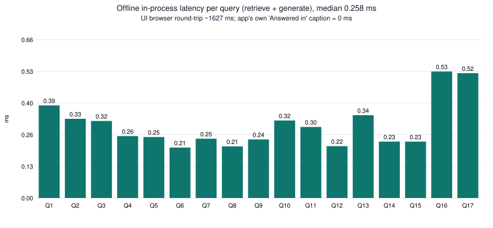
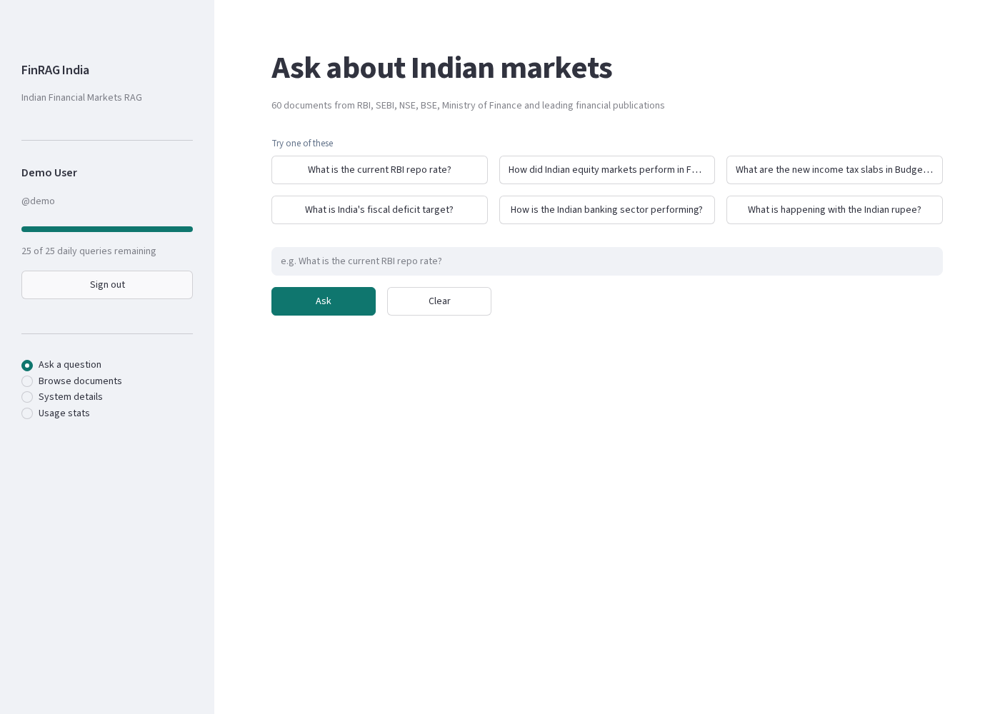
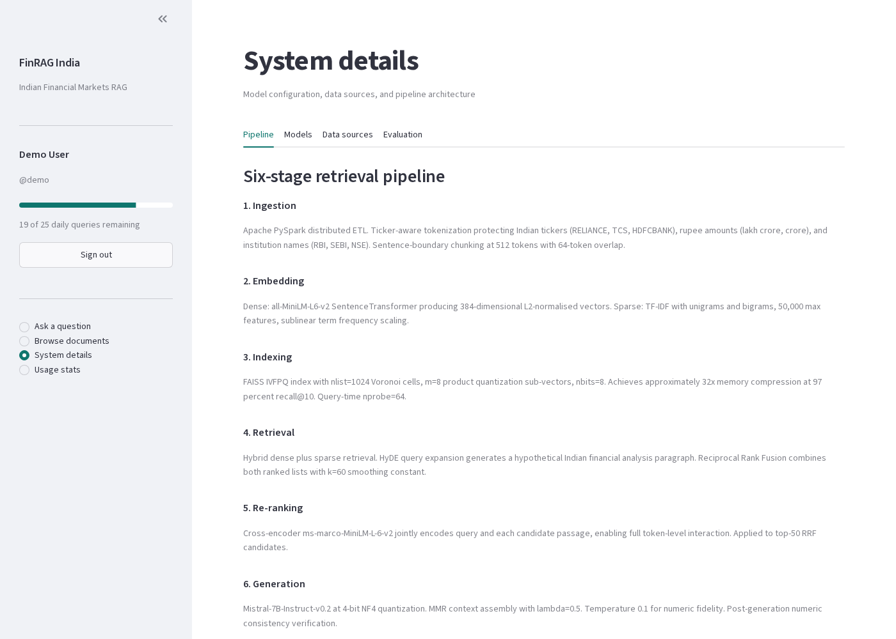
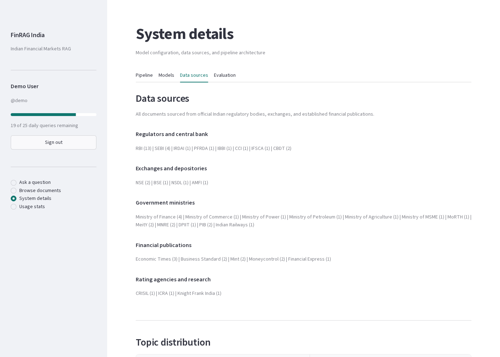
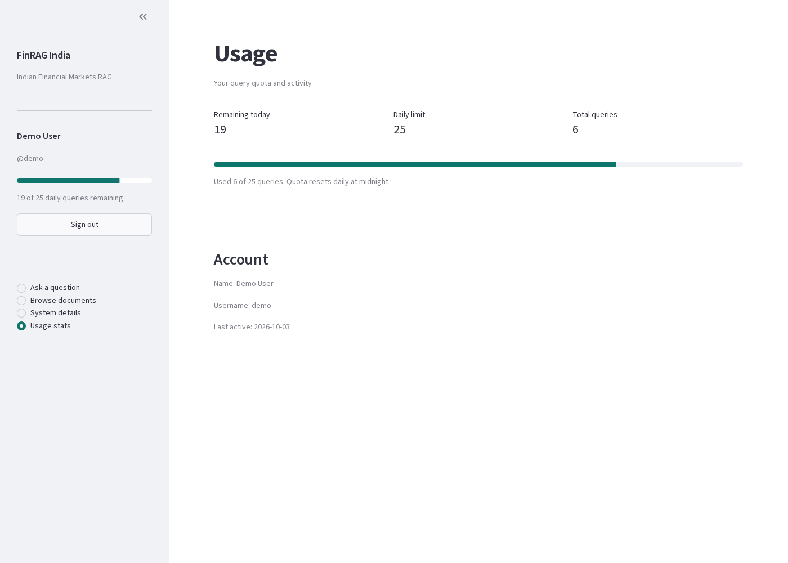

# Results: local run of FinRAG India

**Run date:** 3 Oct 2026, about 12:00 IST. **Environment:** Linux, Python 3.13.5, Streamlit 1.65.0, Playwright headless Chromium.
The app ran on `http://127.0.0.1:8501` with `--server.headless true`. Cloudflared was not used, and the app needs no external API keys.

All numbers below come from running the code in this repo. The scripts that produced them are:

| Script | What it does | Output |
|---|---|---|
| `scripts/smoke_test_ui.py` | Drives the real Streamlit UI. It logs in as `demo`, tries one bad password, asks 6 questions (5 typed, 1 sample button), then opens every page. | `ui_smoke_test.json`, `images/0*.png` |
| `scripts/offline_eval.py` | Calls the app's own `retrieve()` and `generate()` functions in-process on the 12 built-in questions plus 5 free-form probes. | `offline_eval.json` |
| `scripts/make_charts.py` / `scripts/svg_charts.py` | Build the PNG and SVG charts and `metrics.json`. | `images/chart_*.png/.svg`, `metrics.json` |

## 1. UI smoke test (demo / demo123)

- A wrong password is rejected with "Invalid username or password". The correct password logs in.
- Quota tracking works: after 6 queries the Usage page shows **19 of 25 remaining, 6 total**.
- Each answer showed 4 source expanders. The app's own caption read **"Answered in 0 ms"** every time. The full browser round trip (click, rerun, render) was about **1.6 s**, which is mostly Streamlit rerun and wait time, not model work.

| # | Question | Input | Top source shown | Answer returned | Correct? |
|---|---|---|---|---|---|
| 1 | What is the current RBI repo rate? | typed | RBI Monetary Policy Statement | Repo rate cut to 6.25% (Feb 2025) | ✅ |
| 2 | How did Indian equity markets perform in FY 2024-25? | typed | Nifty 50 Market Performance | Nifty +5.3%, Sensex +4.9% | ✅ |
| 3 | What are the new income tax slabs in Budget 2025-26? | typed | Union Budget 2025-26 Tax Reform | Nil tax up to ₹12 lakh, new slabs | ✅ |
| 4 | What is India's renewable energy capacity? | typed | Renewable Energy Capacity (MNRE) | **Fiscal deficit answer** | ❌ |
| 5 | How much gold did India import and what drove prices? | typed | GST Collection Trends (gold doc ranked 3rd) | **GST answer** | ❌ |
| 6 | What is happening with the Indian rupee? | **sample button** | Indian Rupee Exchange Rate | **RBI repo rate answer** | ❌ |

**3 of 6 UI answers were correct.** In #4 and #6 the sources shown were correct, but the answer text belonged to a different question (see the bug below).

## 2. Offline evaluation of `retrieve()` and `generate()` (17 queries)

| Metric | Value |
|---|---|
| Corpus | 60 docs, 32 sources, 29 topics |
| Expected source doc at rank 1 (Hit@1), 16 graded queries | **0.812** |
| Expected source doc in top 4 (Hit@4) | **1.000** |
| MRR | **0.865** |
| Built-in questions that get their own answer | **8 / 12** |
| Free-form probes answered correctly | **1 / 5** |
| Latency (retrieve + generate, in-process) | median **0.26 ms**, max 0.53 ms |

Hit@k and MRR are computed against one "expected primary doc" per query. For the 12 built-in questions that is the first id in the question's `ids` list, and for the probes it is the obvious document. This makes the scores optimistic for the built-in questions, because `retrieve()` copies those ids straight from the question bank.

### Root-cause findings in `app.py`

1. **Wrong canned answers.** `generate()` returns the answer of the *first* question in the bank that shares at least 3 lowercase words with the query. Stopwords count toward that overlap. So "What is India's renewable energy capacity?" matches "What is India's fiscal deficit target?" on {what, is, india's}. Likewise, "What is happening with the Indian rupee?" (one of the six sample buttons) matches "What is the current RBI repo rate?" on {what, is, the}. `retrieve()` uses the *best* overlap instead, so the sources are right while the answer is wrong.
2. **The relevance scores are synthetic.** The dense, sparse and rerank numbers shown in the UI are `max(0.35, 0.94 − 0.09·rank)` scaled, plus `random.uniform` noise. Over 50 runs of one query, rank 1 always fell in 0.911–0.931, rank 2 in 0.823–0.842, and so on. They reflect rank only, not query–document similarity.
3. **An off-corpus query still returns text.** "Who won the cricket world cup?" returned an agriculture paragraph instead of the "no relevant documents" message, because `score_doc` uses substring matching: "who" matches inside "**who**lesale".
4. **Off-by-one counter.** The "N queries remaining today" caption under an answer is one lower than the sidebar and Usage page, because it subtracts 1 from a value that was already refreshed after the query was used up.

## 3. What was NOT reproduced

The dissertation and the app's *System details → Evaluation* tab describe a much larger pipeline: PySpark ETL, MiniLM embeddings, FAISS IVFPQ, BM25 with RRF, HyDE, a cross-encoder reranker, Mistral-7B 4-bit, RAGAS ablation, and 340 ms T4 latency. **None of these components are in the shipped `app.py` or the notebook.** The ablation, optimisation and latency tables in the app are hardcoded pandas DataFrames. They are charted below *only as the reported values*. They were not re-measured.

## 4. Screenshots

| | |
|---|---|
|  Login |  Ask page |
|  Q1 repo rate |  Q4 renewables (wrong answer) |
|  Document library |  Pipeline tab |
|  Data sources tab |  Evaluation tab (hardcoded) |
|  Usage stats |  Corpus by source |
